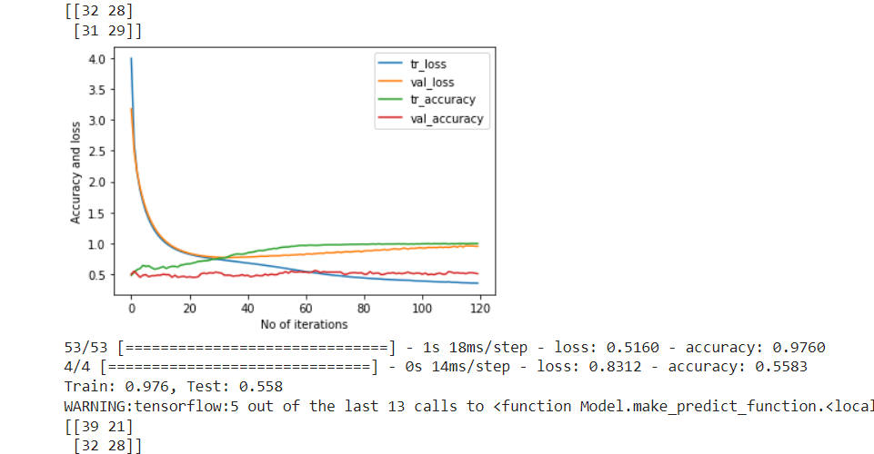

# Motor_Imagery_Unprocessed_75

Minimum Processing

1. Notch Filter of 50 Hz
2. Scaling the data to zero mean unit variance, before feeding to CNN

Test Confusion Matrix

&nbsp;&nbsp;&nbsp;&nbsp;[[17  &nbsp;&nbsp;   5]  
&nbsp;&nbsp;&nbsp;&nbsp; [ 6  &nbsp;&nbsp;   16]]

Model training graph

